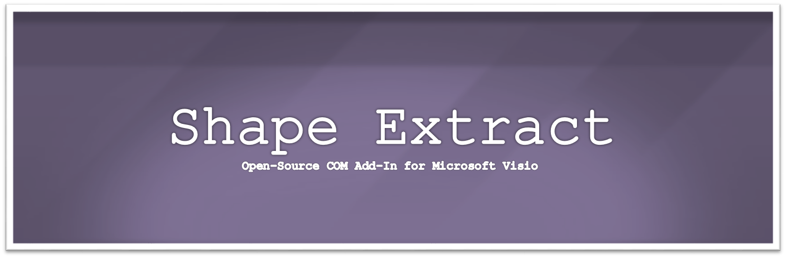
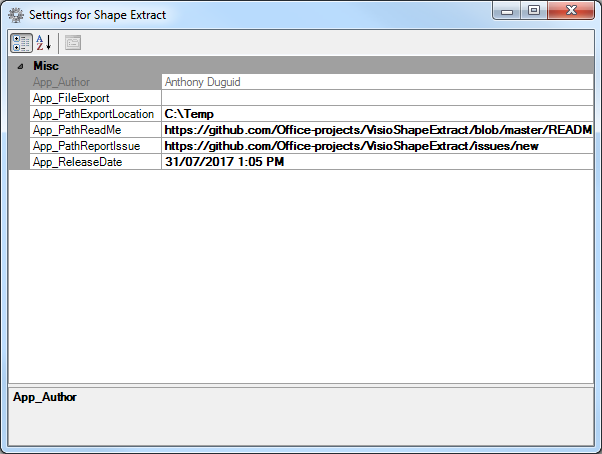
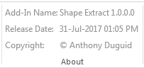

<br><br>

This Add-In extracts the shape attributes' text from a Microsoft Visio file.

VB.NET & VBA versions included :new: I'm currently working on the C# version.

[](https://www.paypal.me/AnthonyDuguid/1.00)
[](https://gitter.im/MicrosoftVisioShapeExtract/Lobby?utm_source=badge&utm_medium=badge&utm_campaign=pr-badge&utm_content=badge)
[](LICENSE "MIT License Copyright © Anthony Duguid")
[](https://github.com/Visio-projects/Visio-Shape-Extract/releases)
[](https://github.com/Visio-projects/Visio-Shape-Extract)
[](https://github.com/Visio-projects/Visio-Shape-Extract/issues)
<!--[](https://github.com/Visio-projects/Visio-Shape-Extract/releases)-->

<h1 align="left">
  
</h1>

<br>

## Table of Contents
- <a href="#install">Install</a>
- <a href="#dependencies">Dependencies</a>
- <a href="#glossary-of-terms">Glossary of Terms</a>
- <a href="#functionality">Functionality</a>
    - <a href="#actions">Actions</a>
    - <a href="#options-group">Options</a>  
    - <a href="#help">Help</a>
    - <a href="#about">About</a>

<br>

<a id="user-content-install" class="anchor" href="#install" aria-hidden="true"> </a>
## Install
Instructions for installation of VBA and VSTO versions.

### VBA
How to install the VBA version
1. Download the VBA Add-In file [](https://github.com/Office-projects/VisioShapeExtract/raw/master/VBA/ShapeExtract.vsdm?raw=true "Download the VBA Add-In").

### VSTO
How to install the VSTO version
1. Download AnthonyDuguid.pfx And Install At Root Level [](https://github.com/Visio-projects/Visio-Shape-Extract/VB/blob/master/AnthonyDuguid.pfx?raw=true "Download AnthonyDuguid.pfx And Install At Root Level For VSTO")
2. Download and run the setup.exe file. ```TODO: publish .NET to GitHub```
<!---
[](https://github.com/Visio-projects/Visio-Shape-Extract/VB/blob/master/publish/setup.exe?raw=true "Download Setup.exe Install File")
--->

<br>

<a id="user-content-dependencies" class="anchor" href="#dependencies" aria-hidden="true"> </a>
## Dependencies
|Software                                   |Dependency                 |Project                    |
|:------------------------------------------|:--------------------------|:--------------------------|
|[Microsoft Visual Studio](https://www.visualstudio.com/vs/whatsnew/)|Solution|VSTO|
|[Microsoft Office Developer Tools](https://visualstudio.microsoft.com/vs/features/office-tools/)|Solution|VSTO|
|[Microsoft Visio](https://www.microsoft.com/en-au/software-download/office)|Project|VBA, VSTO|
|[Visual Basic for Applications](https://msdn.microsoft.com/en-us/vba/vba-language-reference)|Code|VBA|
|[Extensible Markup Language (XML)](https://www.rondebruin.nl/win/s2/win001.htm)|Ribbon|VBA, VSTO|
|[Snagit](http://discover.techsmith.com/snagit-non-brand-desktop/?gclid=CNzQiOTO09UCFVoFKgod9EIB3g)|Read Me|VBA, VSTO|
|Badges ([Library](https://shields.io/), [Custom](https://rozaxe.github.io/factory/), [Star/Fork](http://githubbadges.com))|Read Me|VBA, VSTO|

<br>

<a id="user-content-glossary-of-terms" class="anchor" href="#glossary-of-terms" aria-hidden="true"> </a>
## Glossary of Terms

| Term                      | Meaning                                                                                  |
|:--------------------------|:-----------------------------------------------------------------------------------------|
| COM |Component Object Model (COM) is a binary-interface standard for software components introduced by Microsoft in 1993. It is used to enable inter-process communication and dynamic object creation in a large range of programming languages. COM is the basis for several other Microsoft technologies and frameworks, including OLE, OLE Automation, ActiveX, COM+, DCOM, the Windows shell, DirectX, UMDF and Windows Runtime.  |
| VBA |Visual Basic for Applications (VBA) is an implementation of Microsoft's event-driven programming language Visual Basic 6 and uses the Visual Basic Runtime Library. However, VBA code normally can only run within a host application, rather than as a standalone program. VBA can, however, control one application from another using OLE Automation. VBA can use, but not create, ActiveX/COM DLLs, and later versions add support for class modules.|
| VSTO |Visual Studio Tools for Office (VSTO) is a set of development tools available in the form of a Visual Studio add-in (project templates) and a runtime that allows Microsoft Office 2003 and later versions of Office applications to host the .NET Framework Common Language Runtime (CLR) to expose their functionality via .NET.|
| XML|Extensible Markup Language (XML) is a markup language that defines a set of rules for encoding documents in a format that is both human-readable and machine-readable.The design goals of XML emphasize simplicity, generality, and usability across the Internet. It is a textual data format with strong support via Unicode for different human languages. Although the design of XML focuses on documents, the language is widely used for the representation of arbitrary data structures such as those used in web services.|

<br>

## Functionality
This Visio ribbon named “Shape Extract” is inserted after the “Home” tab when Visio opens.  Listed below is the detailed functionality of this application and its components.  

<a id="user-content-actions" class="anchor" href="#actions" aria-hidden="true"> </a>
### Actions (Group)

####	Export Shapes (Button)
* Exports all the attribute values from each shape to a .csv file

####	Open Folder (Button)
* Opens the export folder

#### Open File (Button)
* Open the export file

<a id="user-content-options" class="anchor" href="#options" aria-hidden="true"> </a>
###	Options (Group)

#### Add-In Settings (Button)

<kbd>
VSTO
<br>
  
</kbd>

- Types of VSTO Settings
  - Application Settings
    - These settings can only be changed in the project and need to be redeployed
    - They will appear disabled in the form
  - User Settings
    - These settings can be changed by the end-user
    - They will appear enabled in the form

<a id="user-content-help" class="anchor" href="#help" aria-hidden="true"> </a>
###	Help (Group)
<h1 align="left">
  
</h1>

<a id="user-content-how-to" class="anchor" href="#how-to" aria-hidden="true"> </a>
####	How To... (Button)
* Opens the how to guide in a browser

<a id="user-content-report-issue" class="anchor" href="#report-issue" aria-hidden="true"> </a>
####	Report Issue (Button)
* Opens the new issue page in a browser

<a id="user-content-new-version" class="anchor" href="#new-version" aria-hidden="true"> </a>
####	New Version Is Available (Button)
* This button is visible if the version of the Add-In is different from the one in the Read Me page. It will download a new version from the site when pressed.

<a id="user-content-about" class="anchor" href="#about" aria-hidden="true"> </a>
###	About (Group)

<h1 align="left">
  
</h1>

<a id="user-content-description" class="anchor" href="#description" aria-hidden="true"> </a>
#### Add-in Name (Label)
* The application name with the version

<a id="user-content-release-date" class="anchor" href="#release-date" aria-hidden="true"> </a>
#### Release Date (Label)
* The release date of the application

<a id="user-content-copyright" class="anchor" href="#copyright" aria-hidden="true"> </a>
#### Copyright (Label)
* The author’s name
