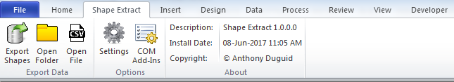

# Microsoft Visio Shape Extract

This is a Visio Add-In written in Visual Studio Community 2017 VB.NET and VBA. It allows the user to extract the entity attributes from a Visio file.

<!---

--->
<h1 align="left">
  
</h1>

## Dependencies
|Software                        |Dependency                 |
|:-------------------------------|:--------------------------|
|[Microsoft Visual Studio Community 2017](https://www.visualstudio.com/vs/whatsnew/)|Solution|
|[Microsoft Visio 2010](https://www.microsoft.com/en-au/software-download/office)|Project|

## Functionality
This Visio ribbon named “Shape Extract” is inserted after the “Home” tab when Visio opens.  Listed below is the detailed functionality of this application and its components.  

### Export Data (Group)

####	Export Shapes (Button)
* Exports all the attribute values from each shape to a .csv file

####	Open Folder (Button)
* Opens the export folder

#### Open File (Button)
* Open the export file

###	Options (Group)

####	Settings (Button)
* Opens the settings form.

####	COM Add-Ins (Button)
* Opens the COM Add-Ins form to manage the available addins

###	About (Group)

#### Description (Label)
* The application name with the version

#### Install Date (Label)
* The install date of the application

#### Copyright (Label)
* The author’s name
